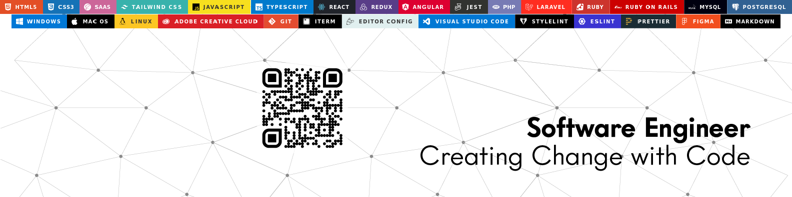

# 👋 Hi, I’m @raminka13

Raul is a passionate software developer with experience in a range of programming languages and technologies. As a graduate of Microverse, Raul has honed his skills in full stack development, with expertise in JavaScript, TypeScript, React, Angular, PHP, Laravel, Ruby, Ruby on Rails, PostgreSQL, MySQL, Sass, CSS, and HTML.
But Raul's talents don't stop there. His dedication to learning and mastering new skills is evident in his eagerness to stay up-to-date with the latest tools and techniques in the industry. This commitment to growth and development makes Raul a valuable asset to any team, and ensures that he is always at the forefront of new trends and technologies.
Beyond his technical abilities, Raul is also a devoted father to his 4-year-old daughter. His commitment to his family and his passion for his work make him a well-rounded and admirable individual. Raul's exceptional problem-solving, analytical, and communication skills, coupled with his collaborative spirit, ensure that he is always able to deliver exceptional results.
In his free time, Raul enjoys [insert hobbies or interests], and is committed to [insert any relevant community involvement or volunteer work]. With his impressive range of skills and his dedication to ongoing learning and growth, Raul is a rising star in the software development field.

- 👀 I’m interested in ... Tech, Nature, Evolution, Life & kindness.
- 💞️ I’m looking to collaborate on any project that help me learn new concepts.
- 🌎 I'm open for hire as a remote developer.

           

### 🔗 How to reach me

- Littlelink: [All My Links.](https://raminka13.github.io/littlelink/)
- GitHub: [@raminka13](https://github.com/raminka13)
- Twitter: [@raminka13](https://twitter.com/raminka13)
- LinkedIn: [Raul Ospina](http://linkedin.com/in/raul-ospina)

 

<!---
raminka13/raminka13 is a ✨ special ✨ repository because its `README.md` (this file) appears on your GitHub profile.
You can click the Preview link to take a look at your changes.
--->
